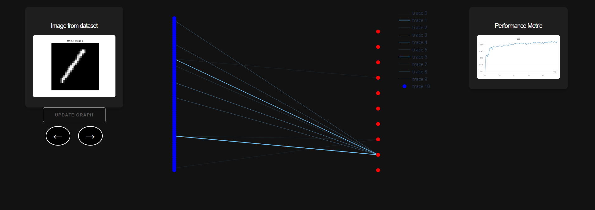

# Visualization-Capsule-Neural-Networks

## About the Project

This project is developed as part of my Bachelor's degree at Technical University in Kosice, under the guidance of Dominic Vranay.

## Project Status



⚠️ This project is currently in development. The functionality and features provided are stable, but the project is being actively improved.

## Overview

This repository contains a Python implementation of a Capsule Neural Network (CapsNet) that is trained and evaluated on the MNIST dataset. The project focuses on visualizing the ___coupling coefficients___ of the network, leveraging a GraphVisualizer class that represents the connections between capsules.

## Features

- Training and evaluation of a Capsule Neural Network using PyTorch.
- Custom class MySampler for balancing classes in each batch during training.
- Visualization of coupling coefficients with an interactive graph.
- A web application built with Dash for an interactive user experience.

## Requirements

- Python
- PyTorch
- NetworkX
- Dash
- Plotly
- Matplotlib

## Installation

___Clone___ the repository and ___install___ the required packages:

> ```git clone https://github.com/LordWhiskas/Visualization-Capsule-Neural-Networks.git ```
>
> ```cd Visualization-Capsule-Neural-Networks```
>
> ```pip install -r requirements.txt```

## Using

> Run the file ```modelLoad.py```
>
> Go to the ___url___ that you will see in console
>
> Click button ```update graph```
>
> You can ___change___ image using ```right``` or ```left``` buttons
>
> After changing image click on ```update graph``` to see new graph

# Changing model 

❗Use custom sampler ```MySampler``` for balancing classes in your dataset. It will improve your model accuracy.

## Acknowledgments

I would like to express my deepest appreciation to Dominic Vranay, who is providing expert guidance and support throughout the development of this project.


